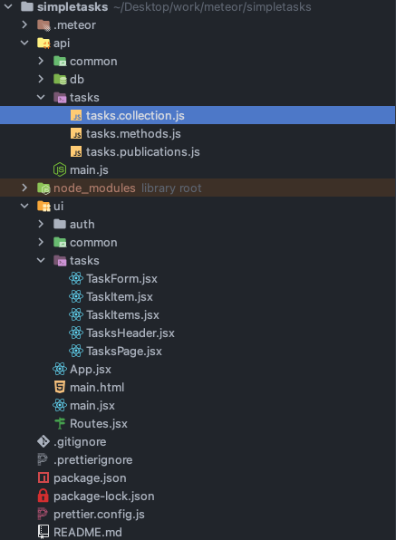
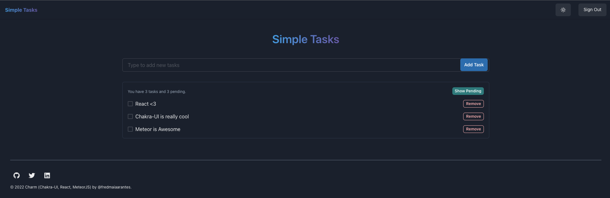
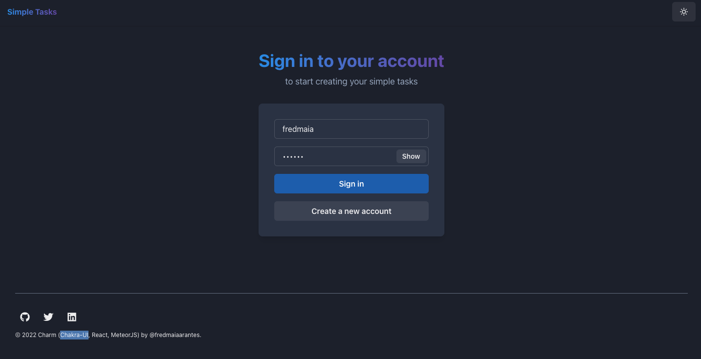
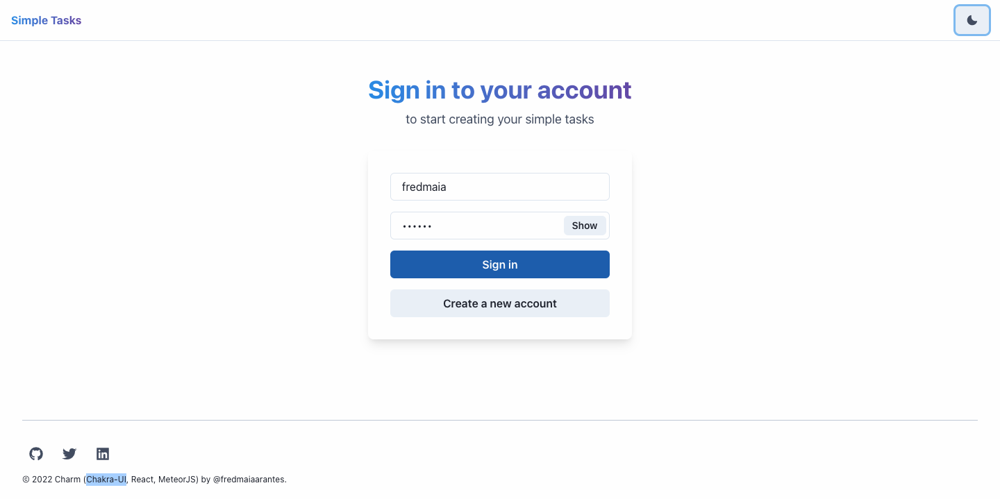

# Charm - Simple Tasks
Built with my new preferred stack: CHARM (Chakra-UI, React, Meteor).

## What and why this stack?
The main goal is to make development as quick and efficient as possible. To achieve this have selected these technologies:

-   [Meteor ](https://meteor.com/)- Fullstack Framework focused on productivity that uses RPCs and Sockets for reactivity
-   [React ](https://reactjs.org/)- Minimal UI Library for building on the web
-   [Chakra UI ](https://chakra-ui.com/)- React library focused on simplicity and productivity
-   [Formik ](https://formik.org/)- Most used Form lib for React focuses on making easier-to-write forms
-   [MongoDB ](https://www.mongodb.com/)- NoSQL and really powerful for prototyping and creating ready-to-use apps out of the box
-   [Meteor Cloud ](https://cloud.meteor.com/)- Cloud provider that makes Deploying a Server with, Database included painless


Demo: https://simpletasks.meteorapp.com/

Author: [@fredmaiaarantes](https://twitter.com/fredmaiaarantes)

Features:
- Sign In / Sign Up
- List Tasks by logged user
- Add Task
- Remove Task
- Mark Task as Done
- Filter Tasks by Status

Video demo:
https://www.loom.com/share/50b9e1a513904b138fb772a332facbfb

## Running the template

### Install dependencies

```bash
meteor npm install
```

### Running

```bash
meteor
```

### Cleaning up you local db

```bash
meteor reset
```

### Deploy to Galaxy with free MongoDB
```bash
meteor deploy <select a subdomain>.meteorapp.com --free --mongo
```

## Done
- Integrate to Chakra-UI
- Use ESLint, Prettier, and Husky
- Host in Galaxy
- Meteor APM monitoring
- Use React Router 6 and Lazy Loading
- Use Formik and yup
- Galaxy SEO Support
- Define directory structure
- Add database migrations

## To Do
- Extend users collection

## Main Meteor packages
- react-meteor-data
- percolate:migrations
- force-ssl
- mdg:seo
- aldeed:collection2

## Tech Explanation

### How is the project structured?

Before explaining, this template is inspired by the works of [Alex Kondov](https://alexkondov.com/): [Tao of Node ](https://alexkondov.com/tao-of-node/) and [Tao of React](https://alexkondov.com/tao-of-react/)

Most Meteor apps are built similar to a monorepo with their divisions for back end and front end declared respectively in `ui ` and `api` folders. You can have a common folder to share code between frontend and backend. For example, if you use TypeScript, you can share types in your codebase.



A good practice that needs to be pointed out is organizing the folders by feature so that when we think about that specific domain feature, we only need to go to that feature folder, and everything exclusive to that feature should be there.

We usually place things in the common directory when we have items that will be used in many places.

### Backend decisions

In this template, we have chosen to use Mongo, shipped out of the box with MeteorJS, and added some packages to make it even more productive. That being said, we decided to use `simpl-schema` and`percolate:migrations`, the first one for validating schemas in run-time and the second for creating database migrations.

#### Database Migrations

> Questions on how to strcuture your migrations ?
>
> **Use api/db/migration.js as your reference**

* * *

This is the kind of feature that sometimes comes in handy. Whenever the server starts, it runs the code below that is located in `api/main.js`:

```javascript
import { Meteor } from "meteor/meteor";
import { Migrations } from "meteor/percolate:migrations";
import "./db/migrations";
import "./tasks/tasks.methods";
import "./tasks/tasks.publications";

/**
 * This is the server-side entry point
 */
Meteor.startup(() => {
  Migrations.migrateTo("latest");
});
```

It gathers all migrations that have not been applied and applies them.

A great use for migrations is when you have a change in your database, and you could need everyone to have at least the default data.

For more details, you can check [the package docs](https://github.com/percolatestudio/meteor-migrations).

#### Schemas

Schemas are a manner to be sure that the data that comes from the front end is the way we expect it to be and also it is sanitized.

We have decided to use simpl-schema attaching it to our collection as you can see in `api/tasks/tasks.collection.js` by doing this, all data that goes to our Database is validated and follow the structure we defined, you can see how a Task is structured, and having that schema, we can start doing methods and publications.

Don't forget to check [simpl-schema docs](https://www.npmjs.com/package/simpl-schema) in case of doubts on how to use it.

#### Server Connection

Following the idea of having a folder for each feature and if it connects to the front end, we need to provide a way to connect.

Meteor works similarly to[ tRPC](https://trpc.io/) and [Blitz.js](https://blitzjs.com/). This model has server functions that get called through a Remote Procedure Call (RPC). In this template, calls that are related to tasks are in the `api/tasks/tasks.methods.js` folder.

```javascript
/**
 * Remove a task.
 * @param {{ taskId: String }}
 * @throws Will throw an error if user is not logged in or is not the task owner.
 */
export const removeTask = ({ taskId }) => {
  checkTaskOwner({ taskId });
  TasksCollection.remove(taskId);
};
...
Meteor.methods({
  insertTask,
  removeTask,
  toggleTaskDone,
});
```

So in order to call this server method, we need to do a call for its name. It would look like this:

```javascript
 onDelete={taskId => Meteor.call('removeTask', { taskId })}
```

This sample comes from `ui/tasks/TaskItems.jsx:`

#### Subscriptions

MeteorJS supports subscriptions out of the box that can be seen in `api/tasks/tasks.publications.js` these publications are called in a similar way to RPC methods, but their values are reactive. For more details on how to deal and think in reactive programming, [Andre Stalz ](http://andre.staltz.com)has [this gist introducing Reactive Programming, ](https://gist.github.com/staltz/868e7e9bc2a7b8c1f754)and [Kris Kowal](https://github.com/kriskowal) has [this Repo](https://github.com/kriskowal/gtor) that discusses the theory of reactivity in-depth.

> For using subscripiton as you can see in our docs, is similar to using methods. In React we use meteor/react-meteor-data for having a react-way of calling those methods

For a good example of Subscriptions, you can look in `ui/tasks/TasksPage.jsx`

### Frontend decisions



#### React with Meteor is &lt;3

As for our frontend framework, we have chosen React for its productive ecosystem and simplicity. Meteor has a package for querying data using hooks, which makes you think about only bringing solutions to life.

For more information, you can check [react-meteor-data repo](https://github.com/meteor/react-packages/tree/master/packages/react-meteor-data#react-meteor-data) for more details on using the best of them.

#### Forms

As one of the key parts of the front end, we have chosen a library to help us deal with this piece. Formik is one of the most expressive ways of writing forms in React, a good template for creating this kind of form is located in `ui/tasks/TaskForm.jsx` it is also integrated with Meteor by its call method.

Want to know more and how to create many things with Formik? [their documentation](https://formik.org/docs/overview).

#### The productivity core: Chakra-UI





For our UI components, we have chosen Chakra UI because of its productivity that matches what Meteor does in the backend creating a lovely flow with an outstanding Developer Experience.

We have included Dark and Light modes. It can be seen those configs in `ui/App.jsx`

You can see Chakra-UI's full component list on t[heir site](https://chakra-ui.com/getting-started)

